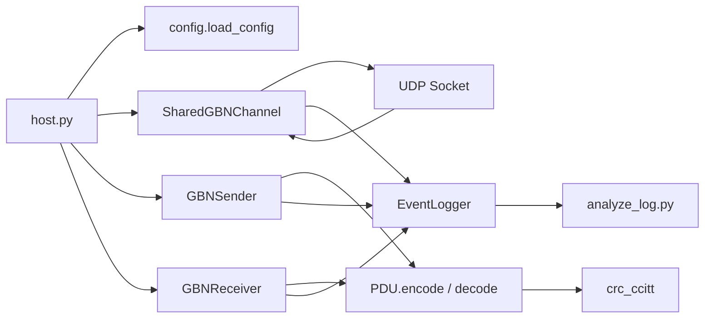
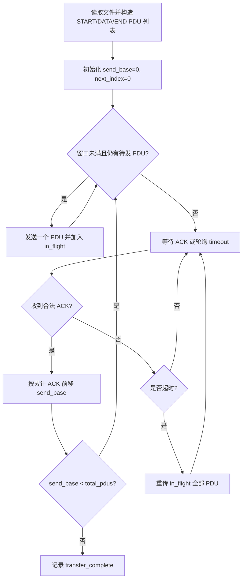
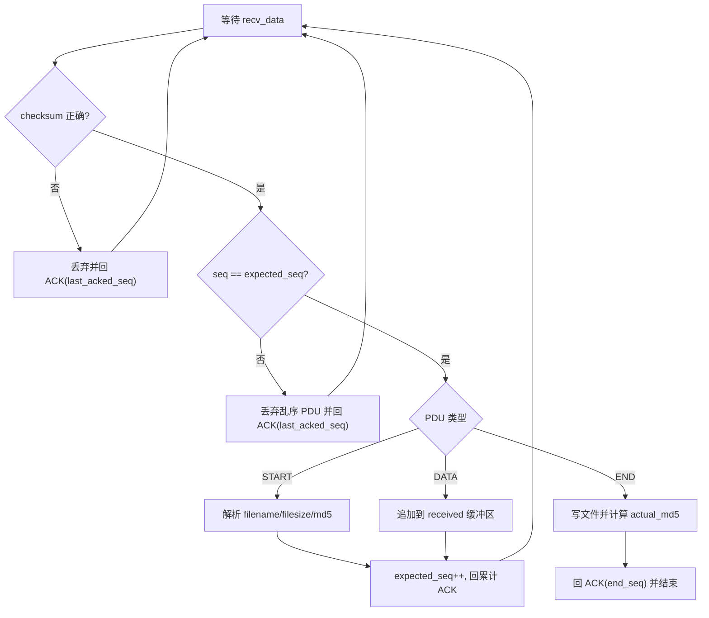
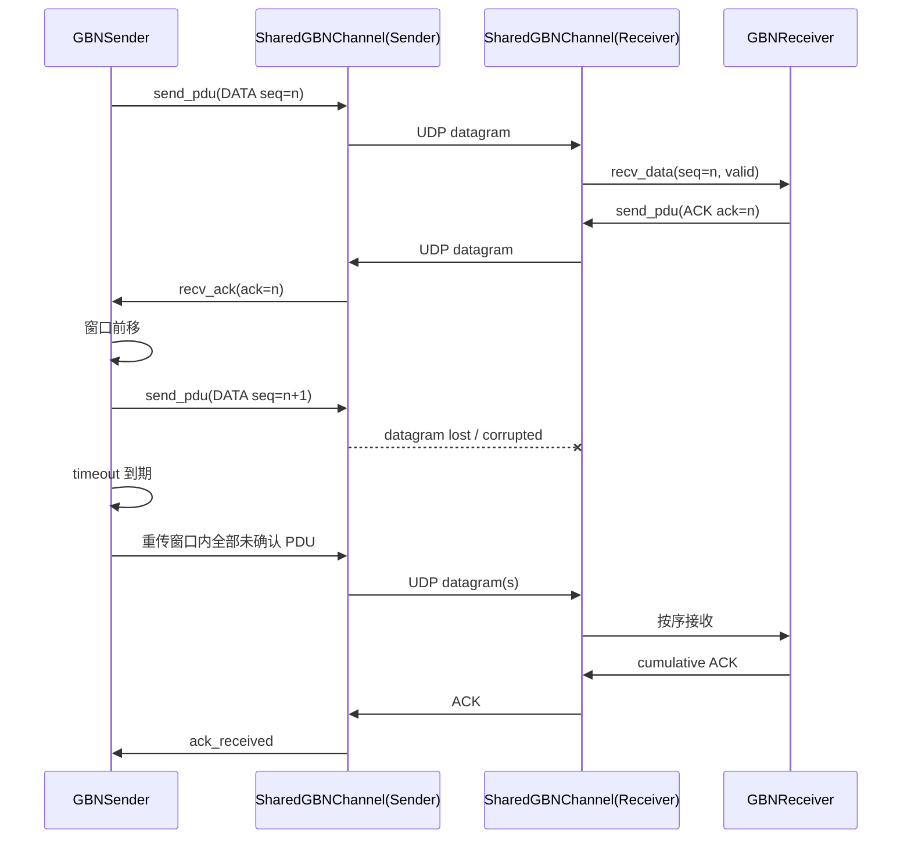
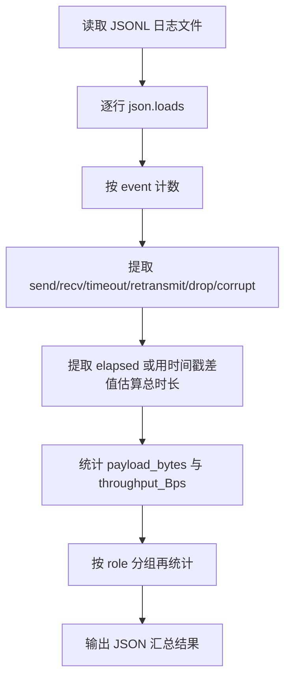

# Project-1 Reliable File Transfer using Go-Back-N 协议 报告素材包

本文档仅依据仓库中的真实代码、配置、日志、构建文件和产物整理，不补写仓库中不存在的实现细节。凡仓库中未发现明确证据之处，均标注为“未实现 / 未发现证据 / 需要人工补充”。

## 一、项目基本信息

### 1. 项目名称

- 仓库展示名称：`Reliable File Transfer using Go-Back-N (Python, UDP)`  
  依据：[README.md](/E:/BIT/a3Junior/Summer/ComputerNetwork/Project1/README.md)
- 课程项目名称：`Project-1 Reliable File Transfer using Go-Back-N protocol`  
  依据：用户提供的课程说明

### 2. 编程语言

- Python  
  依据：[host.py](/E:/BIT/a3Junior/Summer/ComputerNetwork/Project1/host.py:1)、[gbn_sender.py](/E:/BIT/a3Junior/Summer/ComputerNetwork/Project1/gbn_sender.py:1)、[gbn_receiver.py](/E:/BIT/a3Junior/Summer/ComputerNetwork/Project1/gbn_receiver.py:1)

### 3. 运行环境

- 基于标准 `socket` 的 UDP 程序，命令行运行  
  依据：[host.py](/E:/BIT/a3Junior/Summer/ComputerNetwork/Project1/host.py:28)
- 本仓库明确面向 Windows 使用：存在 `dist/gbn_host.exe`、`dist/analyze_log.exe`，并且代码中有 Windows 下 UDP `SIO_UDP_CONNRESET` 兼容处理  
  依据：[gbn_common.py](/E:/BIT/a3Junior/Summer/ComputerNetwork/Project1/gbn_common.py:13)、[dist\gbn_host.exe](/E:/BIT/a3Junior/Summer/ComputerNetwork/Project1/dist/gbn_host.exe)
- Python 精确版本：需要人工补充。  
  说明：仓库中没有 `requirements.txt` 或版本说明；仅从 `__pycache__/*cpython-313.pyc` 可推测至少有一次运行环境为 Python 3.13，但不应当作为唯一正式结论。

### 4. 主要依赖库

- 标准库：`argparse`、`socket`、`threading`、`queue`、`struct`、`configparser`、`hashlib`、`json`、`time`、`pathlib`、`random`
- 第三方库：未发现代码运行所必需的第三方 Python 包
- 构建依赖：存在 PyInstaller `.spec` 文件，说明打包阶段使用过 PyInstaller，但仓库未提供安装说明  
  依据：[gbn_host.spec](/E:/BIT/a3Junior/Summer/ComputerNetwork/Project1/gbn_host.spec)、[analyze_log.spec](/E:/BIT/a3Junior/Summer/ComputerNetwork/Project1/analyze_log.spec)

### 5. 项目目录结构

```text
Project1/
├─ analyze_log.py
├─ analyze_log.spec
├─ analyze_log_exe.spec
├─ config.py
├─ console_reporter.py
├─ crc_ccitt.py
├─ gbn_common.py
├─ gbn_host.spec
├─ gbn_receiver.py
├─ gbn_sender.py
├─ host.py
├─ logger_utils.py
├─ pdu.py
├─ README.md
├─ configs/
│  ├─ host1.ini
│  ├─ host1_loss.ini
│  ├─ host1_error.ini
│  ├─ host2.ini
│  ├─ host2_loss.ini
│  └─ host2_error.ini
├─ logs/
│  ├─ host1_send.jsonl
│  ├─ host2_recv.jsonl
│  ├─ host1_loss_send.jsonl
│  ├─ host2_loss_recv.jsonl
│  ├─ host1_error_send.jsonl
│  ├─ host2_error_recv.jsonl
│  ├─ host1_duplex*.jsonl
│  └─ host2_duplex*.jsonl
├─ dist/
│  ├─ gbn_host.exe
│  └─ analyze_log.exe
├─ build/
├─ received/
├─ host1_received*/
└─ host2_received*/
```

### 6. 程序入口文件

- 传输主程序入口：`host.py`  
  依据：[host.py](/E:/BIT/a3Junior/Summer/ComputerNetwork/Project1/host.py:42)
- 日志分析程序入口：`analyze_log.py`  
  依据：[analyze_log.py](/E:/BIT/a3Junior/Summer/ComputerNetwork/Project1/analyze_log.py:99)

### 7. 主要模块及其作用

| 模块 | 作用 | 依据 |
|---|---|---|
| `host.py` | 命令行参数解析；创建 UDP channel；选择 `send/recv/duplex` 模式 | [host.py](/E:/BIT/a3Junior/Summer/ComputerNetwork/Project1/host.py:17) |
| `config.py` | 读取 INI 配置；校验 `DataSize <= 4096` | [config.py](/E:/BIT/a3Junior/Summer/ComputerNetwork/Project1/config.py:24) |
| `pdu.py` | 定义 PDU 类型、头部格式、编解码、checksum 验证 | [pdu.py](/E:/BIT/a3Junior/Summer/ComputerNetwork/Project1/pdu.py:9) |
| `crc_ccitt.py` | CRC-CCITT 校验值计算 | [crc_ccitt.py](/E:/BIT/a3Junior/Summer/ComputerNetwork/Project1/crc_ccitt.py:4) |
| `gbn_common.py` | UDP 收发共享信道；ACK/DATA 分流；随机丢包与随机差错模拟 | [gbn_common.py](/E:/BIT/a3Junior/Summer/ComputerNetwork/Project1/gbn_common.py:16) |
| `gbn_sender.py` | GBN 发送端；滑动窗口、累计 ACK、timeout、重传 | [gbn_sender.py](/E:/BIT/a3Junior/Summer/ComputerNetwork/Project1/gbn_sender.py:18) |
| `gbn_receiver.py` | GBN 接收端；按序接收、乱序丢弃、累计 ACK、写文件、MD5 对比 | [gbn_receiver.py](/E:/BIT/a3Junior/Summer/ComputerNetwork/Project1/gbn_receiver.py:15) |
| `logger_utils.py` | JSONL 日志写入 | [logger_utils.py](/E:/BIT/a3Junior/Summer/ComputerNetwork/Project1/logger_utils.py:9) |
| `analyze_log.py` | 日志统计分析；输出汇总 JSON | [analyze_log.py](/E:/BIT/a3Junior/Summer/ComputerNetwork/Project1/analyze_log.py:22) |
| `console_reporter.py` | 控制台进度输出 | [console_reporter.py](/E:/BIT/a3Junior/Summer/ComputerNetwork/Project1/console_reporter.py) |

### 8. 是否支持 Windows 10 运行

- 已发现明显支持证据。  
  依据：
- Windows UDP 兼容处理：[gbn_common.py](/E:/BIT/a3Junior/Summer/ComputerNetwork/Project1/gbn_common.py:36)
- 已构建 `dist/gbn_host.exe`、`dist/analyze_log.exe`
- README 中命令示例使用 PowerShell 格式  
  备注：未见在 README 中直接写明“Windows 10”字样，但仓库证据足以支撑“支持 Windows 环境运行”。

### 9. 是否包含可执行程序生成方式

- 已包含 PyInstaller `.spec` 文件：`gbn_host.spec`、`analyze_log.spec`、`analyze_log_exe.spec`
- 已包含打包产物：`dist/gbn_host.exe`、`dist/analyze_log.exe`
- 未发现独立 `build.bat` / `Makefile` / `requirements.txt`
- 可推测打包方式为执行 `pyinstaller gbn_host.spec` 与 `pyinstaller analyze_log.spec`，但具体命令未在 README 明示  

## 二、需求实现情况对照表

| 序号 | 项目要求 | 是否实现 | 对应代码文件 | 对应函数 / 类 / 模块 | 说明 |
|---|---|---|---|---|---|
| 1 | 自定义 PDU 结构 | 已实现 | `pdu.py` | `PDU` | 自定义了 `pdu_type/seq/ack/data` 及固定头格式 |
| 2 | PDU 末尾包含 checksum 字段 | 已实现 | `pdu.py` | `HEADER_FORMAT="!BIIHH"` | 头部包含 2 字节 checksum 字段 |
| 3 | checksum 使用 CRC-CCITT | 已实现 | `crc_ccitt.py`, `pdu.py` | `crc_ccitt`, `PDU.encode/decode` | 使用多项式 `0x1021` |
| 4 | 使用 UDP Socket API 发送和接收 PDU | 已实现 | `host.py`, `gbn_common.py` | `socket.socket`, `sendto`, `recvfrom` | 基于 `AF_INET/SOCK_DGRAM` |
| 5 | 每个 UDP datagram 封装一个 PDU | 已实现 | `gbn_common.py`, `pdu.py` | `send_pdu`, `PDU.encode` | 每次 `sendto` 发送一个编码后的 PDU |
| 6 | PDU 数据部分长度不超过 4KB | 已实现 | `config.py` | `load_config` | 强制 `DataSize <= 4096` |
| 7 | 支持 Go-Back-N 滑动窗口 | 已实现 | `gbn_sender.py` | `send_file` | 用 `send_base`、`next_index`、`sw_size` 控制窗口 |
| 8 | 支持累计 ACK | 已实现 | `gbn_receiver.py`, `gbn_sender.py` | `ack_sent`, `ack_received` 逻辑 | ACK 表示“最后一个按序收到的 seq” |
| 9 | 支持超时重传 | 已实现 | `gbn_sender.py` | `send_file` | 定时检查 `timeout`，超时后重传 |
| 10 | 支持 Go-Back-N 式重传 | 已实现 | `gbn_sender.py` | `for index, pdu in in_flight.items()` | 从最早未确认 PDU 开始，把窗口内所有未确认 PDU 重传 |
| 11 | 支持双向 / 全双工文件传输 | 已实现 | `host.py` | `duplex` 模式，双线程 | `duplex_sender` 与 `duplex_receiver` 并发运行，共享一个 UDP socket |
| 12 | 支持随机 PDU 错误模拟 | 已实现 | `gbn_common.py` | `send_pdu` | 按 `error_rate` 翻转最后 1 个字节 |
| 13 | 支持随机 PDU 丢失模拟 | 已实现 | `gbn_common.py` | `send_pdu` | 按 `lost_rate` 直接记录 `send_drop` 并返回 |
| 14 | 支持通过配置文件设置参数 | 已实现 | `config.py`, `configs/*.ini` | `load_config` | 通过 INI 读取 |
| 15 | 配置项包括 UDPPort、PeerIP、PeerPort、DataSize、ErrorRate、LostRate、SWSize、InitSeqNo、Timeout 等 | 已实现 | `configs/*.ini`, `config.py` | `HostConfig` | 以上字段均在代码中读取 |
| 16 | 支持通信日志记录 | 已实现 | `logger_utils.py`, 全部主模块 | `EventLogger.log` | 写入 JSONL |
| 17 | 每次发送 PDU 记录日志 | 已实现 | `gbn_common.py` | `send_pdu` | 记录 `event="send"` |
| 18 | 每次接收 PDU 记录日志 | 已实现 | `gbn_common.py` | `_recv_loop` | 记录 `event="recv"` |
| 19 | 支持日志统计分析 | 已实现 | `analyze_log.py` | `analyze`, `summarize_records` | 统计多项指标 |
| 20 | 支持统计总 PDU 数、发送次数、超时次数、重传次数、总耗时、吞吐率等 | 已实现 | `analyze_log.py` | `summarize_records` | 已直接统计上述指标；“传输效率”未直接输出 |
| 21 | 支持使用 3MB 以上文件测试 | 已实现 | `test_3mb.bin`, `README.md`, `logs/host1_send.jsonl` | 运行记录 | 仓库中有 `3,145,728` 字节测试文件与对应收发日志 |
| 22 | 支持校验接收文件与原始文件完全一致 | 已实现 | `gbn_sender.py`, `gbn_receiver.py`, `README.md` | `_md5_of_file`, `_md5_of_bytes` | START 元数据里发送 MD5；接收端写文件后比对；README 还给出 `Get-FileHash` 方法 |
| 23 | 是否支持多主机传输（可选） | 部分实现 | `configs/*.ini`, `gbn_common.py` | `peer_addr` | 代码支持配置任意 `PeerIP/PeerPort` 的单对等主机；未发现多主机路由/多 peer 管理 |
| 24 | 是否使用多进程、多线程、队列等并发技术（可选） | 已实现 | `host.py`, `gbn_common.py`, `logger_utils.py` | `threading`, `queue.Queue`, `Lock` | duplex 模式双线程；channel 后台收包线程；ACK/DATA 队列分流 |

## 三、系统需求分析素材

### 1. 为什么 UDP 本身不能保证可靠文件传输

UDP 是无连接、尽力而为的传输协议，本身不保证数据一定到达，也不保证按序到达、只到达一次，亦不负责超时重传和端到端完整性恢复。因此，如果直接把文件切块后通过 UDP 发送，在出现丢包、乱序或比特错误时，接收端无法依靠 UDP 自动恢复出完整文件。

### 2. 为什么需要在 UDP 上实现可靠传输机制

本项目的目标不是使用 TCP，而是在 UDP Socket 之上自行实现可靠传输流程，这样可以把“分片、编号、确认、超时、重传、差错检测、窗口控制”等可靠传输机制显式实现出来。仓库中的 `GBNSender`、`GBNReceiver`、`PDU`、`crc_ccitt` 和 `SharedGBNChannel` 正是围绕这一目标组织的。

### 3. Go-Back-N 协议在本项目中的作用

本项目用 Go-Back-N 实现发送端滑动窗口和接收端按序接收机制。发送端维护窗口内多个未确认 PDU，提高 UDP 传输效率；接收端只接收 `expected_seq`，对乱序或损坏 PDU 丢弃并返回最新累计 ACK；当最早未确认分组超时后，发送端重传当前窗口内全部未确认 PDU。这一行为与代码中的 `send_base`、`next_index`、`expected_seq` 和 timeout 重传逻辑一致。

### 4. 本项目需要解决的主要问题

- PDU 分片：发送端按 `DataSize` 读取文件并切成多个 DATA PDU，见 [gbn_sender.py](/E:/BIT/a3Junior/Summer/ComputerNetwork/Project1/gbn_sender.py:29)。
- 序号管理：发送端从 `InitSeqNo` 起为 START、DATA、END 连续编号，接收端维护 `expected_seq`，见 [gbn_sender.py](/E:/BIT/a3Junior/Summer/ComputerNetwork/Project1/gbn_sender.py:54) 与 [gbn_receiver.py](/E:/BIT/a3Junior/Summer/ComputerNetwork/Project1/gbn_receiver.py:39)。
- 滑动窗口控制：发送端用 `send_base` 与 `next_index` 控制窗口推进，见 [gbn_sender.py](/E:/BIT/a3Junior/Summer/ComputerNetwork/Project1/gbn_sender.py:82)。
- ACK 确认：接收端返回累计 ACK，ACK 的 `ack` 字段表示最后一个按序接收成功的序号，见 [gbn_receiver.py](/E:/BIT/a3Junior/Summer/ComputerNetwork/Project1/gbn_receiver.py:147)。
- 超时检测：发送端周期性等待 ACK，若超过 `Timeout` 则触发超时，见 [gbn_sender.py](/E:/BIT/a3Junior/Summer/ComputerNetwork/Project1/gbn_sender.py:116)。
- 重传机制：超时后重传窗口内所有未确认 PDU，见 [gbn_sender.py](/E:/BIT/a3Junior/Summer/ComputerNetwork/Project1/gbn_sender.py:141)。
- 差错检测：PDU 编码时计算 CRC-CCITT，解码时重算并比较，见 [pdu.py](/E:/BIT/a3Junior/Summer/ComputerNetwork/Project1/pdu.py:26)。
- 丢包模拟：发送前按 `LostRate` 丢弃，见 [gbn_common.py](/E:/BIT/a3Junior/Summer/ComputerNetwork/Project1/gbn_common.py:72)。
- 文件完整性恢复：START PDU 携带 `filename/filesize/md5`，接收端写出文件后进行 MD5 对比，见 [gbn_sender.py](/E:/BIT/a3Junior/Summer/ComputerNetwork/Project1/gbn_sender.py:55) 与 [gbn_receiver.py](/E:/BIT/a3Junior/Summer/ComputerNetwork/Project1/gbn_receiver.py:119)。
- 日志与性能分析：所有关键事件写入 JSONL，再用 `analyze_log.py` 汇总，见 [logger_utils.py](/E:/BIT/a3Junior/Summer/ComputerNetwork/Project1/logger_utils.py:15) 与 [analyze_log.py](/E:/BIT/a3Junior/Summer/ComputerNetwork/Project1/analyze_log.py:22)。

### 5. 根据当前代码，项目实际实现了哪些功能

从仓库证据看，项目已实现单向传输、双向 duplex 传输、滑动窗口、累计 ACK、timeout 重传、随机丢包、随机差错、INI 配置、JSONL 日志、日志分析、接收文件 MD5 校验，以及 Windows 可执行程序打包产物。未发现序号回绕控制、序号空间与窗口大小约束检查、多主机并发管理、自动化批量测试脚本、专门的性能绘图脚本。

## 四、系统设计素材

### 1. 系统总体架构

- 发送端：`GBNSender`
- 接收端：`GBNReceiver`
- UDP 通信模块：`SharedGBNChannel`
- PDU 编解码模块：`PDU.encode()` / `PDU.decode()`
- GBN 协议控制模块：`GBNSender.send_file()` 与 `GBNReceiver.receive_file()`
- 配置读取模块：`load_config()`
- 日志模块：`EventLogger`
- 日志分析模块：`analyze_log.py`

### 2. PDU 结构设计

代码中的头部格式为 `!BIIHH`，字段顺序如下：

| 字段 | 长度 | 说明 | 依据 |
|---|---:|---|---|
| `pdu_type` | 1 byte | PDU 类型 | [pdu.py](/E:/BIT/a3Junior/Summer/ComputerNetwork/Project1/pdu.py:15) |
| `seq` | 4 bytes | 序号 | 同上 |
| `ack` | 4 bytes | ACK 字段 | 同上 |
| `data_len` | 2 bytes | 数据长度 | 同上 |
| `checksum` | 2 bytes | CRC-CCITT 校验值 | 同上 |
| `data` | `data_len` bytes | 负载数据 | [pdu.py](/E:/BIT/a3Junior/Summer/ComputerNetwork/Project1/pdu.py:45) |

### 3. PDU 类型

代码中定义的真实类型只有：

| 名称 | 值 | 说明 |
|---|---:|---|
| `TYPE_START` | 1 | 发送文件元数据 |
| `TYPE_DATA` | 2 | 发送文件块 |
| `TYPE_ACK` | 3 | 累计 ACK |
| `TYPE_END` | 4 | 结束传输 |

未发现 `FIN`、`SYN`、`NAK` 等其他类型定义。

### 4. CRC-CCITT 设计

- 生成方式：`PDU.encode()` 先把 checksum 位置填 0，再对“头部(校验位置为 0) + data”计算 CRC-CCITT，最后写回 checksum 字段。  
  依据：[pdu.py](/E:/BIT/a3Junior/Summer/ComputerNetwork/Project1/pdu.py:26)
- 校验方式：`PDU.decode()` 解包后重建“头部(校验位置为 0) + data”，再次计算 CRC-CCITT，与收到的 checksum 比较，返回 `(PDU, is_valid)`。  
  依据：[pdu.py](/E:/BIT/a3Junior/Summer/ComputerNetwork/Project1/pdu.py:47)
- CRC 函数：`crc_ccitt(data, init_value=0xFFFF)`  
  依据：[crc_ccitt.py](/E:/BIT/a3Junior/Summer/ComputerNetwork/Project1/crc_ccitt.py:4)

### 5. 滑动窗口设计

- `send_base`：当前窗口最左侧、最早未确认 PDU 的索引  
  依据：[gbn_sender.py](/E:/BIT/a3Junior/Summer/ComputerNetwork/Project1/gbn_sender.py:82)
- `next_index`：下一次准备发送的 PDU 索引  
  依据：[gbn_sender.py](/E:/BIT/a3Junior/Summer/ComputerNetwork/Project1/gbn_sender.py:83)
- `window size`：来自配置 `SWSize`  
  依据：[config.py](/E:/BIT/a3Junior/Summer/ComputerNetwork/Project1/config.py:42)
- `sequence number space`：未见显式上限；当前实现使用 Python `int` 单调递增
- ACK 处理规则：若 `ack_seq` 小于当前 `send_base` 对应序号，则忽略；否则把 `seq <= ack_seq` 的窗口内 PDU 统统确认并前移窗口  
  依据：[gbn_sender.py](/E:/BIT/a3Junior/Summer/ComputerNetwork/Project1/gbn_sender.py:163)
- 超时重传规则：若最早未确认 PDU 等待时间超过 `Timeout`，则重传 `in_flight` 中全部未确认 PDU  
  依据：[gbn_sender.py](/E:/BIT/a3Junior/Summer/ComputerNetwork/Project1/gbn_sender.py:125)
- 序号回绕：未实现 / 未发现证据
- 最大窗口大小与序号空间关系：未实现检查 / 未发现证据

### 6. 接收端设计

- `expected_seq`：期望收到的下一个按序序号  
  依据：[gbn_receiver.py](/E:/BIT/a3Junior/Summer/ComputerNetwork/Project1/gbn_receiver.py:39)
- 正确 PDU 处理规则：
  - 若为 `START`，解析 JSON 元数据
  - 若为 `DATA`，追加到 `received` 缓冲
  - 若为 `END`，写文件并记录 MD5 对比
- 错误 PDU 处理规则：`checksum` 不通过则丢弃，并回复 `last_acked_seq`
- 乱序 PDU 处理规则：`pdu.seq != expected_seq` 时丢弃，并回复 `last_acked_seq`
- ACK 返回规则：对每个按序收到的 PDU 发送累计 ACK；对错误或乱序 PDU 也发送最近一次正确 ACK
- 文件写入规则：只在接收到 `TYPE_END` 后统一写出文件  

### 7. 错误和丢失模拟设计

- `ErrorRate` 生效位置：发送前，在 `send_pdu()` 内部
- `LostRate` 生效位置：发送前，在 `send_pdu()` 内部
- 差错模拟方式：把编码后的字节串最后一个字节异或 `0xFF`
- 丢包模拟方式：直接记录 `send_drop` 后返回，不调用 `sendto`
- 接收端不会主动制造错误，只负责校验和丢弃  
  依据：[gbn_common.py](/E:/BIT/a3Junior/Summer/ComputerNetwork/Project1/gbn_common.py:62)

### 8. 日志设计

- 日志格式：JSONL，一行一个 JSON 对象
- 日志写入路径：由命令行 `--log` 指定
- 典型发送日志字段：`time,event,role,pdu_type,seq,ack,data_len,retransmission,note`
- 典型接收日志字段：`time,event,role,pdu_type,seq,ack,data_len,checksum_ok`
- 样例：

```json
{"time":1779117395.32285,"event":"send","role":"sender","pdu_type":1,"seq":1,"ack":0,"data_len":92,"retransmission":false,"note":""}
{"time":1779117395.323088,"event":"recv","role":"receiver","pdu_type":1,"seq":1,"ack":0,"data_len":92,"checksum_ok":true}
```

- 是否每次文件传输生成一个日志文件：从 README 的命令与 `logs/` 目录看，设计上是“每次实验手动指定一个日志文件”；不是程序自动按时间新建  

### 9. 并发设计

- 使用 `threading`
- 使用 `queue.Queue`
- 使用 `threading.Lock`
- duplex 模式中：
  - 一个线程执行 `GBNSender.send_file()`
  - 一个线程执行 `GBNReceiver.receive_file()`
  - `SharedGBNChannel` 另有一个后台接收线程持续 `recvfrom`
- 因此仓库中确实使用了并发技术，并支持全双工  
  依据：[host.py](/E:/BIT/a3Junior/Summer/ComputerNetwork/Project1/host.py:76)、[gbn_common.py](/E:/BIT/a3Junior/Summer/ComputerNetwork/Project1/gbn_common.py:50)

## 五、流程图和时序图素材

### 1. 系统总体架构图



### 2. 发送端 GBN 流程图



### 3. 接收端 GBN 流程图



### 4. PDU 发送、ACK、超时重传时序图



### 5. 日志分析流程图



## 六、开发与实现素材

### 1. 开发语言和版本

- 开发语言：Python
- 版本：需要人工补充
- 证据补充说明：仓库存在 `cpython-313.pyc`，可作为“运行痕迹”而非正式版本声明

### 2. 操作系统

- 主要证据指向 Windows 环境
- README 命令使用 PowerShell
- 代码包含 Windows UDP 兼容分支

### 3. 第三方库

- 运行时第三方库：未发现
- 打包工具：PyInstaller（从 `.spec` 文件推断）

### 4. 项目结构

见“项目基本信息”中的目录结构。

### 5. 关键文件说明

| 文件 | 说明 |
|---|---|
| `host.py` | 程序入口，选择发送/接收/duplex |
| `pdu.py` | PDU 定义与编解码 |
| `crc_ccitt.py` | CRC-CCITT 计算 |
| `gbn_common.py` | UDP 共享通道、丢包/差错模拟、ACK/DATA 分发 |
| `gbn_sender.py` | GBN 发送端逻辑 |
| `gbn_receiver.py` | GBN 接收端逻辑 |
| `config.py` | INI 配置加载 |
| `logger_utils.py` | JSONL 日志记录 |
| `analyze_log.py` | 日志分析 |
| `gbn_host.spec` | 主程序 exe 打包规格 |

### 6. 关键类 / 函数说明

#### PDU 编码函数

- 文件路径：`pdu.py`
- 函数名：`PDU.encode`
- 功能说明：打包头部，计算 CRC-CCITT，输出单个 UDP datagram 负载
- 作用：保证发送前 PDU 结构一致，并附带 checksum

```python
def encode(self) -> bytes:
    data_len = len(self.data)
    header_wo_checksum = struct.pack(
        HEADER_FORMAT, self.pdu_type, self.seq, self.ack, data_len, 0
    )
    checksum = crc_ccitt(header_wo_checksum + self.data)
    header = struct.pack(
        HEADER_FORMAT, self.pdu_type, self.seq, self.ack, data_len, checksum
    )
    return header + self.data
```

#### PDU 解码函数

- 文件路径：`pdu.py`
- 函数名：`PDU.decode`
- 功能说明：解包字节串、检查 `data_len`、重算 checksum
- 作用：供接收端和 channel 判断 PDU 是否有效

```python
@staticmethod
def decode(packet: bytes) -> tuple["PDU", bool]:
    pdu_type, seq, ack, data_len, checksum = struct.unpack(
        HEADER_FORMAT, packet[:HEADER_SIZE]
    )
    data = packet[HEADER_SIZE:]
    if len(data) != data_len:
        raise ValueError("data_len mismatch")
    header_wo_checksum = struct.pack(
        HEADER_FORMAT, pdu_type, seq, ack, data_len, 0
    )
    expected = crc_ccitt(header_wo_checksum + data)
    return PDU(pdu_type=pdu_type, seq=seq, ack=ack, data=data), expected == checksum
```

#### CRC-CCITT 函数

- 文件路径：`crc_ccitt.py`
- 函数名：`crc_ccitt`
- 功能说明：按位计算 CRC-CCITT
- 作用：提供端到端差错检测

```python
def crc_ccitt(data: bytes, init_value: int = 0xFFFF) -> int:
    crc = init_value
    for byte in data:
        crc ^= byte << 8
        for _ in range(8):
            if crc & 0x8000:
                crc = ((crc << 1) ^ 0x1021) & 0xFFFF
            else:
                crc = (crc << 1) & 0xFFFF
    return crc
```

#### 发送窗口控制函数

- 文件路径：`gbn_sender.py`
- 函数名：`GBNSender.send_file`
- 功能说明：根据 `send_base/next_index/SWSize` 控制 GBN 滑动窗口
- 作用：实现连续发送多个未确认 PDU 的核心逻辑

```python
while send_base < total_pdus:
    while next_index < total_pdus and next_index < send_base + self.config.sw_size:
        pdu = pdus[next_index]
        channel.send_pdu(pdu, role=role, is_retransmission=False)
        in_flight[next_index] = pdu
        if send_base == next_index:
            timer_started_at = time.time()
        next_index += 1
```

#### ACK 处理函数

- 文件路径：`gbn_sender.py`
- 函数名：`GBNSender.send_file` 中 ACK 处理段
- 功能说明：处理累计 ACK，推进窗口
- 作用：决定哪些 PDU 已可靠送达

```python
ack_seq = incoming.ack
if send_base < total_pdus and ack_seq < pdus[send_base].seq:
    continue
while send_base < total_pdus and pdus[send_base].seq <= ack_seq:
    in_flight.pop(send_base, None)
    send_base += 1
```

#### 超时重传函数

- 文件路径：`gbn_sender.py`
- 函数名：`GBNSender.send_file` 中 timeout 处理段
- 功能说明：检测 timeout，并重传窗口内全部未确认 PDU
- 作用：保证 GBN 在丢包/差错情况下继续推进

```python
if elapsed_since_timer_start < self.config.timeout:
    continue
for index, pdu in in_flight.items():
    channel.send_pdu(
        pdu, role=role, is_retransmission=True, note="timeout_retransmit"
    )
    retransmitted_pdus += 1
```

#### 接收端处理函数

- 文件路径：`gbn_receiver.py`
- 函数名：`GBNReceiver.receive_file`
- 功能说明：按序接收、错误检测、ACK 返回、END 后写文件
- 作用：实现 GBN 接收端行为

```python
if not is_valid:
    ack = PDU(TYPE_ACK, seq=0, ack=last_acked_seq, data=b"")
    channel.send_pdu(ack, role=role, note="ack_for_corrupted")
    continue
if pdu.seq != expected_seq:
    ack = PDU(TYPE_ACK, seq=0, ack=last_acked_seq, data=b"")
    channel.send_pdu(ack, role=role, note="ack_for_out_of_order")
    continue
```

#### 文件读取函数

- 文件路径：`gbn_sender.py`
- 函数名：`GBNSender._read_chunks`
- 功能说明：按 `DataSize` 分块读取文件
- 作用：把文件切成 DATA PDU 负载

```python
def _read_chunks(self, file_path: str | Path) -> list[bytes]:
    chunks: list[bytes] = []
    with open(file_path, "rb") as fp:
        while True:
            chunk = fp.read(self.config.data_size)
            if not chunk:
                break
            chunks.append(chunk)
    return chunks
```

#### 文件写入函数

- 文件路径：`gbn_receiver.py`
- 函数名：`GBNReceiver.receive_file` 中 END 处理段
- 功能说明：收到 END 后一次性写出缓冲内容
- 作用：落盘接收结果并做 MD5 对比

```python
out_path.write_bytes(received)
actual_md5 = self._md5_of_bytes(received)
self.logger.log(
    event="file_written",
    role=role,
    file=str(out_path),
    expected_md5=expected_md5,
    actual_md5=actual_md5,
    md5_ok=(actual_md5 == expected_md5),
)
```

#### 配置文件读取函数

- 文件路径：`config.py`
- 函数名：`load_config`
- 功能说明：读取并校验 INI 参数
- 作用：为 sender/receiver/channel 注入统一运行参数

```python
section = parser["DEFAULT"]
data_size = section.getint("DataSize")
if data_size <= 0 or data_size > MAX_DATA_SIZE:
    raise ValueError(f"DataSize must be in [1, {MAX_DATA_SIZE}]")
return HostConfig(
    udp_port=section.getint("UDPPort"),
    peer_ip=section.get("PeerIP"),
    peer_port=section.getint("PeerPort"),
```

#### 日志记录函数

- 文件路径：`logger_utils.py`
- 函数名：`EventLogger.log`
- 功能说明：按行写 JSON 记录
- 作用：支撑后续分析与实验复现

```python
def log(self, **fields: object) -> None:
    record = {
        "time": round(time.time(), 6),
        **fields,
    }
    with self._lock:
        with self.log_path.open("a", encoding="utf-8") as fp:
            fp.write(json.dumps(record, ensure_ascii=True) + "\n")
```

#### 日志分析函数

- 文件路径：`analyze_log.py`
- 函数名：`summarize_records`
- 功能说明：统计发送、接收、timeout、重传、吞吐率等
- 作用：为报告中的性能数据提供依据

```python
event_counts = Counter(r.get("event") for r in records)
send_count = event_counts["send"]
recv_count = event_counts["recv"]
timeout_count = event_counts["timeout"]
retransmit_count = event_counts["retransmit"]
...
throughput = (total_data_bytes / total_time) if total_time > 0 else 0.0
```

#### 打包为 Windows 可执行程序的方法

- 证据文件：`gbn_host.spec`、`analyze_log.spec`
- 可确认内容：仓库已使用 PyInstaller 风格 `.spec` 并生成 `dist/*.exe`
- 需要人工补充：实际打包环境版本、是否执行过 `pyinstaller gbn_host.spec`

## 七、部署、启动和使用说明素材

### 1. 如何安装依赖

仓库未提供 `requirements.txt`。从源码看，运行主程序只依赖 Python 标准库。若需要重新打包 exe，需要人工安装 PyInstaller。

### 2. 如何准备测试文件

已有现成测试文件：

- `test_3mb.bin`
- `host1_small.bin`
- `host2_small.bin`
- `host1_data.bin`
- `host2_data.bin`

README 还给出了生成 3MB 文件的命令：

```powershell
@'
from pathlib import Path
Path("test_3mb.bin").write_bytes(b"A" * 3 * 1024 * 1024)
'@ | python -
```

### 3. 如何配置 Host1

编辑或使用 `configs/host1.ini`：

```ini
[DEFAULT]
UDPPort = 40527
PeerIP = 127.0.0.1
PeerPort = 40528
DataSize = 1024
ErrorRate = 0.0
LostRate = 0.0
SWSize = 8
InitSeqNo = 1
Timeout = 0.5
```

### 4. 如何配置 Host2

编辑或使用 `configs/host2.ini`：

```ini
[DEFAULT]
UDPPort = 40528
PeerIP = 127.0.0.1
PeerPort = 40527
DataSize = 1024
ErrorRate = 0.0
LostRate = 0.0
SWSize = 8
InitSeqNo = 1
Timeout = 0.5
```

### 5. 如何启动 Host1

单向发送：

```powershell
python host.py --config configs/host1.ini --mode send --file test_3mb.bin --log logs/host1_send.jsonl
```

### 6. 如何启动 Host2

单向接收：

```powershell
python host.py --config configs/host2.ini --mode recv --output-dir received --log logs/host2_recv.jsonl
```

### 7. 如何进行双向文件传输

Host2：

```powershell
python host.py --config configs/host2.ini --mode duplex --file host2_data.bin --output-dir host2_received --log logs/host2_duplex.jsonl
```

Host1：

```powershell
python host.py --config configs/host1.ini --mode duplex --file host1_data.bin --output-dir host1_received --log logs/host1_duplex.jsonl
```

### 8. 如何查看日志

日志保存在 `logs/*.jsonl`，可直接打开，或用 PowerShell 查看前几行：

```powershell
Get-Content logs/host1_send.jsonl -TotalCount 5
Get-Content logs/host2_recv.jsonl -TotalCount 5
```

### 9. 如何运行日志分析程序

```powershell
python analyze_log.py logs/host1_send.jsonl
python analyze_log.py logs/host2_recv.jsonl
```

exe 版：

```powershell
dist\analyze_log.exe logs/host1_send.jsonl
dist\analyze_log.exe logs/host2_recv.jsonl
```

### 10. 如何校验接收文件与原始文件一致

```powershell
Get-FileHash test_3mb.bin -Algorithm MD5
Get-FileHash received\test_3mb.bin -Algorithm MD5
```

双向场景可分别对两侧原文件与接收文件比对。

### 11. 如何生成 Windows 10 可执行程序

仓库有 PyInstaller `.spec`，可尝试：

```powershell
pyinstaller gbn_host.spec
pyinstaller analyze_log.spec
```

但仓库没有提供正式打包脚本与环境说明，因此这一步建议标注“需要人工补充打包环境配置”。

### 12. 如何运行 Windows 10 可执行程序

```powershell
dist\gbn_host.exe --config configs/host2.ini --mode recv --output-dir received --log logs/host2_recv.jsonl
dist\gbn_host.exe --config configs/host1.ini --mode send --file test_3mb.bin --log logs/host1_send.jsonl
```

## 八、系统测试素材

说明：本仓库存在部分真实日志与接收产物，可写成“已有实验结果”；对于未见现成证据的组合，以下表格写为“测试计划 / 需要人工补充”。

| 测试编号 | 测试目标 | 配置参数 | 输入文件大小 | 操作步骤 | 预期结果 | 实际结果 | 是否通过 | 证据文件 / 日志路径 |
|---|---|---|---:|---|---|---|---|---|
| T01 | 无丢包、无错误的小文件单向传输 | `host1.ini` / `host2.ini` | 需要人工补充 | 启动 Host2 recv，再启动 Host1 send | 正常完成，MD5 一致 | 仓库未发现针对该组合的独立小文件单向日志 | 需要人工补充 | 未发现对应日志 |
| T02 | 无丢包、无错误的 3MB 以上单向传输 | `host1.ini` / `host2.ini` | `3,145,728` B | 使用 README 命令运行 send/recv | 完成传输，MD5 一致 | 已发现 `test_3mb.bin` 与 `received/test_3mb.bin` MD5 相同；sender/receiver 日志均存在 | 通过 | `logs/host1_send.jsonl`, `logs/host2_recv.jsonl`, `received/test_3mb.bin` |
| T03 | 有 PDU 丢失时的单向传输 | `host1_loss.ini` / `host2_loss.ini` | `3,145,728` B | 按 README loss 命令运行 | 出现 timeout / retransmit，但最终文件正确 | `timeout_count=272`, `retransmit_count=2176`；接收端有 `out_of_order_drop_count=1848` | 通过 | `logs/host1_loss_send.jsonl`, `logs/host2_loss_recv.jsonl` |
| T04 | 有 PDU 错误时的单向传输 | `host1_error.ini` / `host2_error.ini` | `3,145,728` B | 按 README error 命令运行 | 出现 corrupted / timeout / retransmit，最终文件正确 | sender `corrupt_count=62`, `timeout_count=54`；receiver `corrupted_drop_count=62` | 通过 | `logs/host1_error_send.jsonl`, `logs/host2_error_recv.jsonl` |
| T05 | 不同窗口大小对比测试 | 需要人工补充 | 需要人工补充 | 修改 `SWSize` 多次运行 | 比较吞吐率与重传变化 | 仓库无成组对比日志 | 需要人工补充 | 未发现现成批量测试结果 |
| T06 | 不同 timeout 对比测试 | 需要人工补充 | 需要人工补充 | 修改 `Timeout` 多次运行 | 比较超时次数与吞吐率变化 | 仓库无成组对比日志 | 需要人工补充 | 未发现现成批量测试结果 |
| T07 | 不同 DataSize 对比测试 | 需要人工补充 | 需要人工补充 | 修改 `DataSize` 多次运行 | 比较 PDU 数量与吞吐率变化 | 仓库无成组对比日志 | 需要人工补充 | 未发现现成批量测试结果 |
| T08 | 双向全双工传输测试 | `host1.ini` / `host2.ini` | 小文件和较大文件均有样例 | 两端同时以 `duplex` 启动 | 双向均完成，双方接收文件正确 | 发现 `host1_received_small/host2_small.bin` 与原文件 MD5 一致；`host2_received_small/host1_small.bin` 也一致。较大文件样例目录也存在 | 通过 | `logs/host1_duplex_small.jsonl`, `logs/host2_duplex_small.jsonl`, `host1_received_small`, `host2_received_small` |
| T09 | 接收文件完整性校验测试 | 任意 | 3MB、大文件、小文件 | 传输后执行 `Get-FileHash` | 原文件与接收文件哈希一致 | 已核对 `test_3mb.bin`、`host1_small.bin`、`host2_small.bin`、`host1_data.bin`、`host2_data.bin` 的多组接收结果 | 通过 | `received/`, `host1_received_*`, `host2_received_*` |

## 九、性能分析素材

### 1. 可放入报告的性能数据表

| 场景 | 文件/说明 | DataSize | SWSize | ErrorRate | LostRate | Timeout | 发送次数 | 超时次数 | 重传次数 | 总耗时(s) | 吞吐率(B/s) | 依据 |
|---|---|---:|---:|---:|---:|---:|---:|---:|---:|---:|---:|---|
| 单向无损发送端 | `test_3mb.bin` | 1024 | 8 | 0 | 0 | 0.5 | 6148 | 0 | 0 | 5.404289 | 1164159.80 | `logs/host1_send.jsonl` |
| 单向无损接收端 | `test_3mb.bin` | 1024 | 8 | 0 | 0 | 0.5 | 6148 ACK发送 | 0 | 0 | 8.875739 | 708837.43 | `logs/host2_recv.jsonl` |
| 单向丢包发送端 | `test_3mb.bin` | 1024 | 8 | 0 | 0.03 | 0.3 | 11070 | 272 | 2176 | 48.645117 | 232901.81 | `logs/host1_loss_send.jsonl` |
| 单向丢包接收端 | `test_3mb.bin` | 1024 | 8 | 0 | 0.03 | 0.3 | 11070 ACK发送 | 0 | 0 | 60.589101 | 186989.67 | `logs/host2_loss_recv.jsonl` |
| 单向差错发送端 | `test_3mb.bin` | 1024 | 8 | 0.02 | 0 | 0.3 | 3506 | 54 | 432 | 29.894853 | 120023.87 | `logs/host1_error_send.jsonl` |
| 单向差错接收端 | `test_3mb.bin` | 1024 | 8 | 0.02 | 0 | 0.3 | 3506 ACK发送 | 0 | 0 | 39.898719 | 89930.11 | `logs/host2_error_recv.jsonl` |

### 2. 可以画图的数据表（CSV 格式建议）

建议后续另存为 CSV：

```csv
scenario,file_size_bytes,data_size,sw_size,error_rate,lost_rate,timeout_sec,send_count,timeout_count,retransmit_count,out_of_order_drop_count,corrupted_drop_count,total_time_sec,throughput_Bps
single_clean_sender,3145728,1024,8,0.0,0.0,0.5,6148,0,0,0,0,5.404289,1164159.80
single_loss_sender,3145728,1024,8,0.0,0.03,0.3,11070,272,2176,0,0,48.645117,232901.81
single_error_sender,3145728,1024,8,0.02,0.0,0.3,3506,54,432,0,0,29.894853,120023.87
single_loss_receiver,3145728,1024,8,0.0,0.03,0.3,10752,0,0,1848,0,60.589101,186989.67
single_error_receiver,3145728,1024,8,0.02,0.0,0.3,3506,0,0,370,62,39.898719,89930.11
```

### 3. 对性能结果的分析文字

从现有日志看，无丢包、无差错场景吞吐率最高，发送端没有出现 timeout 和重传，说明 GBN 基本流程在理想链路上可以顺利推进。引入 `LostRate=0.03` 后，发送端 timeout 次数和重传次数明显上升，吞吐率显著下降，接收端也出现大量乱序丢弃，这与 GBN 在丢包场景下需要从最早未确认 PDU 开始回退重传的特征一致。

引入 `ErrorRate=0.02` 后，日志中出现 `send_corrupt`、`discard_corrupted`、timeout 和 retransmit，说明 CRC-CCITT 校验与错误恢复路径被真实触发。由于差错会打断累计 ACK 的连续推进，因此即使没有显式丢包，也会造成额外超时与重传。

### 4. 不同窗口大小的影响

- 仓库没有现成的多组 `SWSize` 对比日志
- 理论上窗口增大可提高链路利用率，但在丢包环境下也可能扩大一次 timeout 后的回退重传代价
- 该部分应在后续实验中补充真实数据

### 5. 不同丢包率的影响

- 仓库已有 `LostRate=0.03` 的真实实验
- 结论：丢包率上升会增加 timeout、重传和乱序丢弃，并降低吞吐率
- 更高或更多丢包率分组：需要运行实验后补充

### 6. 不同错误率的影响

- 仓库已有 `ErrorRate=0.02` 的真实实验
- 结论：错误率上升会引发 checksum 失败、损坏丢弃、timeout 和重传，吞吐率下降
- 更多错误率档位：需要运行实验后补充

### 7. 不同 timeout 的影响

- 仓库无现成对比实验
- 建议围绕 `0.1 / 0.3 / 0.5 / 1.0` 秒设计实验
- 需要运行实验后补充

### 8. 不同 DataSize 的影响

- 仓库当前主要运行记录都使用 `DataSize = 1024`
- 无现成多组对比日志
- 需要运行实验后补充

### 9. 传输效率

- `analyze_log.py` 未直接输出“传输效率”
- 报告中可人工定义为：`原始有效载荷字节 / 实际发送总载荷字节` 或 `原始文件大小 / 日志统计 payload_bytes`
- 由于 duplex 日志中 sender/receiver 混合统计口径较复杂，建议人工统一公式后再补数据

## 十、报告截图清单

| 截图项 | 截图目的 | 建议章节 |
|---|---|---|
| 项目目录结构截图 | 展示工程组成、源码与日志文件组织方式 | 项目基本信息 / 系统实现 |
| Host1 启动截图 | 展示发送端命令、配置与运行模式 | 部署与使用说明 / 系统测试 |
| Host2 启动截图 | 展示接收端命令、配置与运行模式 | 部署与使用说明 / 系统测试 |
| 文件传输过程截图 | 展示控制台进度、ACK 推进、接收进度 | 系统测试 / 实现效果 |
| 日志文件截图 | 展示 JSONL 日志格式与字段 | 日志设计 |
| 日志分析结果截图 | 展示 `analyze_log.py` 的统计输出 | 性能分析 |
| 原始文件与接收文件 MD5/SHA256 一致性截图 | 证明文件传输正确性 | 系统测试 |
| 不同参数测试结果截图 | 展示 loss/error/window/timeout 对结果影响 | 性能分析 |
| Windows exe 运行截图 | 证明可执行程序方式可用 | 部署与使用说明 / 提交材料 |

## 十一、最终提交文件清单

### 1. 推荐文件名

- Word 报告：`1120230527辜允泽班号待补充 ReliableFileTransferUsingGBN-项目报告.docx`
- PPT 报告：`1120230527辜允泽班号待补充 ReliableFileTransferUsingGBN-项目报告.pptx`
- 源工程压缩包：`1120230527辜允泽班号待补充 ReliableFileTransferUsingGBN-源工程.zip`
- 可执行程序：`1120230527ReliableFileTransferUsingGBN.exe`

### 2. 每个文件应包含什么

- Word 报告：需求分析、协议原理、系统设计、关键实现、测试、性能分析、总结
- PPT 报告：10 分钟展示材料，建议 8 到 12 页
- 源工程压缩包：源码、配置、README、日志样例、测试文件、spec 文件
- 可执行程序：建议提交 `gbn_host.exe`；若课程允许，可附带 `analyze_log.exe`

### 3. 打包前检查清单

- 源码是否能运行
- `configs/*.ini` 是否完整
- README 命令是否可复现
- 日志文件是否保留关键实验样例
- `dist/*.exe` 是否可运行
- 报告与 PPT 中截图、数据、文件名是否一致
- 所有提交文件名是否符合课程规范

### 4. 是否可能超过 250MB，如何避免

- 当前仓库体量看起来大概率不会超过 250MB，但 `build/` 与重复日志可能会增加压缩包体积
- 建议避免提交：
  - `__pycache__/`
  - 不必要的 `build/`
  - 重复实验日志
  - 不必要的大体积中间文件

## 十二、PPT 汇报素材

### 建议页数与时长

- 建议 10 页
- 总时长约 10 分钟

| 页码 | 页面标题 | 核心内容 | 建议配图 / 截图 | 讲解要点 | 预计时间 |
|---|---|---|---|---|---|
| 1 | 项目背景与目标 | 课程任务、为什么在 UDP 上实现可靠传输 | 项目标题页 | 点出 UDP 不可靠、目标是实现 GBN 可靠文件传输 | 0.8 分钟 |
| 2 | 需求分析 | 分片、序号、ACK、timeout、重传、checksum、日志 | 需求列表 | 把课程要求拆成协议功能与工程功能两类 | 1.0 分钟 |
| 3 | GBN 协议原理 | sender window、累计 ACK、超时回退重传 | GBN 时序图 | 说明为什么选 GBN 而不是停等 | 1.0 分钟 |
| 4 | 系统总体架构 | `host.py`、sender、receiver、channel、logger、analyzer | 架构图 | 展示模块划分与调用关系 | 1.0 分钟 |
| 5 | PDU 结构设计 | `type/seq/ack/data_len/checksum/data` | PDU 结构示意图 | 说明自定义 PDU 与 CRC-CCITT 的关系 | 1.0 分钟 |
| 6 | 发送端设计 | 分块、建包、窗口、ACK 处理、timeout 重传 | 发送端流程图 | 重点讲 `send_base`、`next_index` | 1.2 分钟 |
| 7 | 接收端设计 | `expected_seq`、按序接收、乱序/损坏丢弃、累计 ACK | 接收端流程图 | 强调接收端只接受按序包 | 1.0 分钟 |
| 8 | 差错与丢包模拟 | `LostRate`、`ErrorRate`、日志记录方式 | 代码截图或日志截图 | 说明实验如何构造异常场景 | 0.8 分钟 |
| 9 | 系统测试与性能结果 | 无损、丢包、差错三类测试与统计数据 | 日志分析结果截图、MD5 截图 | 强调“仓库有真实日志证据” | 1.2 分钟 |
| 10 | 总结与改进 | 已实现功能、未实现点、后续可扩展项 | 总结页 | 诚实说明未做序号回绕、多参数批量实验等 | 1.0 分钟 |

说明：课程说明提到 PPT 可选且要求 audio narration，但仓库未发现音频文件或音频脚本，因此这里只提供讲稿素材，不生成音频。

## 十三、最终输出说明

本次已生成以下文档：

- `REPORT_MATERIALS.md`
- `CODE_INVENTORY.md`
- `TEST_PLAN.md`
- `PERFORMANCE_ANALYSIS_TEMPLATE.md`
- `PPT_OUTLINE.md`
- `SUBMISSION_CHECKLIST.md`

所有结论均优先基于以下证据类型：

- 代码：`host.py`, `gbn_sender.py`, `gbn_receiver.py`, `gbn_common.py`, `pdu.py`, `crc_ccitt.py`, `config.py`, `logger_utils.py`, `analyze_log.py`
- 配置：`configs/*.ini`
- 日志：`logs/*.jsonl`
- 接收产物：`received/`, `host1_received_*`, `host2_received_*`
- 构建文件：`*.spec`, `dist/*.exe`
